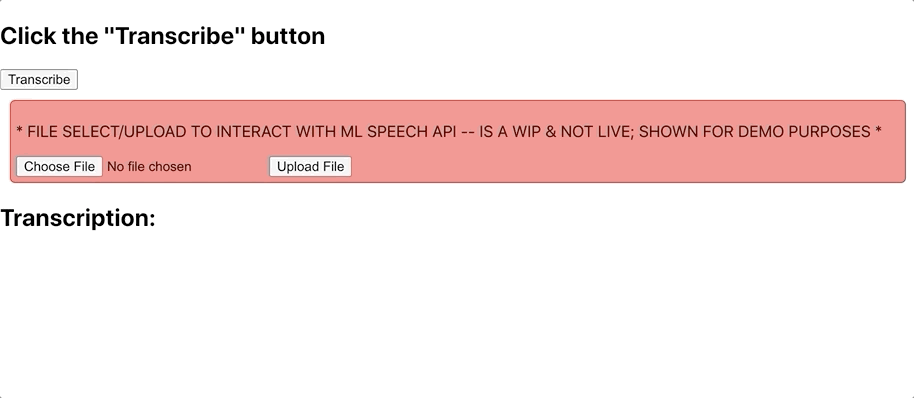

# Google Speech-to-Text API
Basic web app that (currently) has static audio file (in `/sample-audio`) converted from speech to text & displayed in the web UI. Future-state to allow file upload and storge within GCloud; currently only pulls the hard-coded file from GCloud.

## Working Demo:
Deployed (kind of) on Heroku: [here](https://enigmatic-peak-41879.herokuapp.com/)

...due to private keyfile from GCloud, the demo cannot access the API/storage, so nothing really happens. May migrate to [GCloud](https://cloud.google.com/solutions/migrating-nodejs-apps-from-heroku-to-cloud-run) but above shows what happens if ran locally.

## Available Scripts

In the project directory, you can run:

### `npm run dev`

Runs the app in the development mode. 
Open [http://localhost:3000](http://localhost:3000) to view frontend in the browser.
Open [http://localhost:8080/audio-transcription](http://localhost:8080/audio-transcription) to view the backend data.

### `npm run start`

Runs the app in the production mode. 

Be sure to create the project & set up all relevant credentials on GCloud -- including:
- Cloud-to-Speech-Text API
- GCloud Storage

Once this is set up, you must create a [Service Account Key](https://cloud.google.com/docs/authentication/getting-started#setting_the_environment_variable) -- download the `.json` file and place it in a local directory (e.g., `private`) or host on GCloud. Additionally, you must create a `.env` file in the root directory that specifies the following:
- `PORT=8080`
- `GOOGLE_APPLICATION_CREDENTIALS="./path/to/<YOUR_KEY_FILE>.json"`